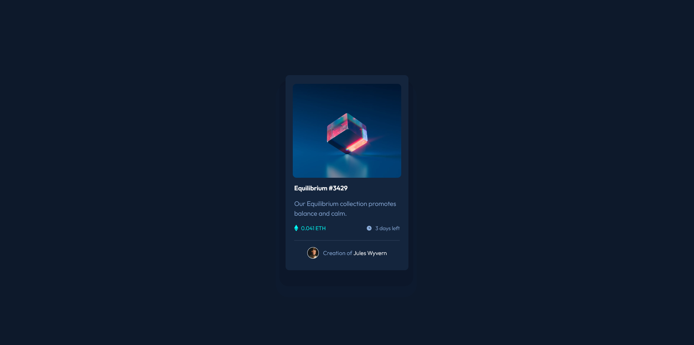

## Overview

NFT preview card component project which is a challenge on [Frontend mentor](https://www.frontendmentor.io/challenges/nft-preview-card-component-SbdUL_w0U).
that was build my own perspective via UI designs, they initially gave out of projects.

### The challenge

Users should be able to:

- View the optimal layout depending on their device's screen size
- See hover states for interactive elements

### Screenshot



### Links
- You can check to the component from live server.
- Live Site URL: [Live Site](https://suatcg-nftcard.netlify.app/)

## My process

- I buit the first of all the html elements.
- After I set the css pre-defined specs which are universal selector that includes box-sizing set to border-box and get rid of all pre-defined margin and padding.
- I set the font-size to 62,5% , thefore I could use the rem value at the sizes according to the 10px.
- Container component divided semanticly
  navigation, body , footer... and so on.
- I centered the container elment to the entire page via flex-box.
- I started to sytling top to bottom respectively.
- End of the container, I was tried to add box shadow likewise frontendmentor, they are did.

### Built with

- Semantic HTML5 markup
- CSS custom properties
- Flexbox
- Desktop-first workflow

### What I learned

I've learnt two things while I was trying to
compose same component , first thing is setting the box-shadow properties of fourth value that is spread-radious and it does help me out to glued edges, because it doesn't work just only adding horizontal and vertical offset negative and positive values to them.In meanwhile, use the shade of background color that I assumed frontend mentor could have been set like me.

```css
.container {
  box-shadow: -2px 30px 0px 15px hsla(217, 54%, 4%, 0.1), -2px 50px 0px 25px hsl(217, 54%, 12%, 0.9);
}
```

Other things, that I learnt from to draw to vertical line after card-footer section along to side-side. I used to border-bottom property in order to make it thinner than normal border visuals.

```css
.card-footer {
  border-bottom: 1px solid hsl(215, 32%, 27%);
}
```

## Author

- Frontend Mentor - [@suatcg](https://www.frontendmentor.io/profile/suatcg)
- Twitter - [@suatcg](https://twitter.com/suatcg)

## Acknowledgments

I've been trying to put left side to .author div elemet but I could not via flex-box. I supposed it has to work but it is centered to card compenent.

Meanwile, I didn't add to media querries out of it works responsively correct likewise I expected. I believe works due to accommodate
center of body. If you were look at, I would be appreciate. then you could give your advice.

Last thing I would like to say, I will add hover state later.I haven't done yet.
